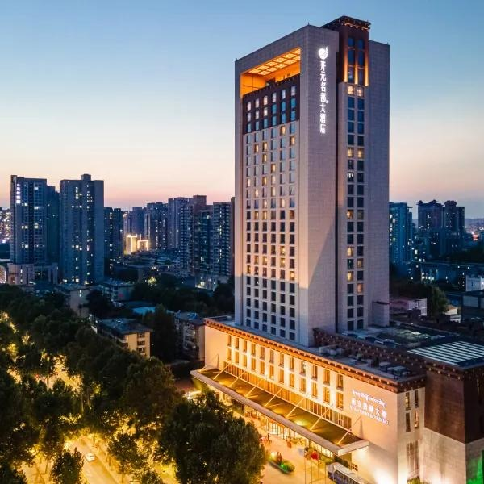
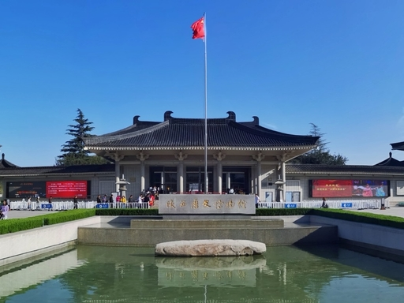
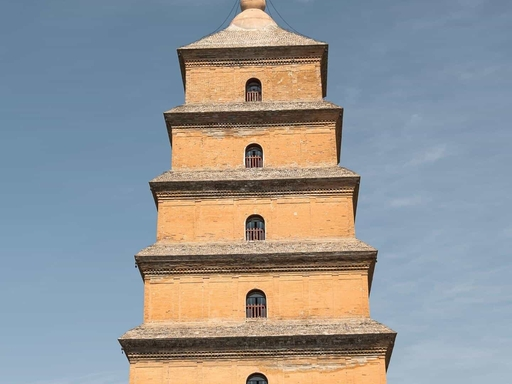
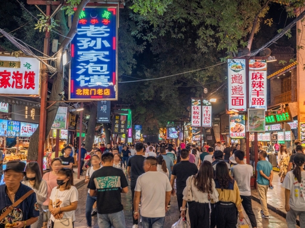

# 住哪里

0529
全季酒店(西安丈八东路电子城店)
地址；雁塔区丈八东路103号

0530
西藏大厦开元名都酒店
地址：碑林区友谊东路 333 号（近雁塔北路）

# 必去景点
- [ ] 陕西历史博物馆（雁塔区，酒店东南约 2km）

- [ ] 大雁塔・大慈恩寺（陕历博南约 1.2km）

- [ ] 回民街（距离陕历博约 6.3km）

# 必吃美食

- [ ] biangbiang 面

- [ ] 长安大牌档小吃

- [ ] 肉夹馍 + 冰峰

- [ ] 甑糕

- [ ] 回民街打包美食
1.油茶麻花
2.肉丸胡辣汤
3.馄饨
4.牛肉面（汤）
5.牛肉面（干拌）
6.牛肉粉蒸肉
7.麻酱豆皮涮牛肚
8.卤制凉粉
9.孜然炒肉夹馍
10.牛肉小酥肉
11.焖牛肉丸子
12.小炒馍馍
13.鸡蛋汤
14.牛肉蔬菜汤
15.八宝稀饭

# 具体行程

## 5.30 下午 + 晚上（住开元名都）

14:00–14:30 酒店出发 → 大雁塔（地铁最顺）
酒店 → 李家村站（步行 3–5 分钟）
4 号线（往航天新城）→ **大雁塔站**（3 站，约 8 分钟）
出站：东南口出，直达大雁塔北广场
14:30–16:00 大雁塔・大慈恩寺（轻松逛）
北广场→南广场（玄奘像打卡）→入园（门票 40 元）
**红墙拍照**、主殿走走，不登塔也可
16:00–16:40 大悦城 4 楼观景台（免费）
从大雁塔南广场西侧步行 2 分钟到大悦城
4 楼平台拍**大雁塔全景**，日落前后最好看
16:40–17:40 晚餐（大悦城 / 慈恩路，步行）
推荐（步行 5 分钟内）：
**子午路张记（慈恩路店）**：肉夹馍 + 冰峰
大悦城负一层：**甑糕**、茶话弄（桂花引）
18:50–19:10 大雁塔北广场音乐喷泉（19:00 场）
从大悦城步行回北广场约 5 分钟
19:00 场灯光 + 音乐，10 分钟，北端正对大雁塔最佳
19:20–21:30 大唐不夜城夜游（步行直达）
北广场→南广场→不夜城北入口（步行约 8 分钟）
路线：诗词街 → 玄奘像 → 主街灯光
演出挑 2 场：19:20 盛唐密盒、**19:50 不倒翁**
21:30–22:30 夜宵 + 回酒店
不夜城周边：**biangbiang 面、长安大牌档小吃**
返程：大雁塔站→李家村站（4 号线，3 站）→步行回酒店

## 5.31 上午（退房后，去陕历博）

08:30–09:00 酒店退房 → **陕西历史博物馆**
酒店→李家村站→4 号线→大雁塔站→3 号线→小寨站→2 号线→会展中心站（不推荐）
更简单：直接打车（约 20 元，15 分钟），或
地铁 4 号线→大雁塔站→步行 1.2km（15 分钟）
09:00–11:30 陕西历史博物馆（**需要提前5天预约！**）
地址：小寨东路 91 号
开放：8:30–19:00（18:00 止票）
只看**核心展厅（周秦汉唐）**，2 小时慢慢逛
11:30–12:30 午餐（陕历博附近）
推荐：**邢老三肉丸糊辣汤 + 油饼**（本地早餐）
或：城南饺子馆（酸汤水饺）

♦